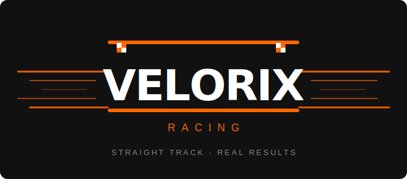

  

# Velorix Racing

A self-hosted Hot Wheels straight track league management system. Run it on a Raspberry Pi, a home server, or any machine with PHP and SQLite. Manage your league from a desktop, run races from a phone or tablet, and let anyone on your network follow standings and statistics.

Straight track only. Real results. Real careers.

---

## Features

- **League management** — one league per installation, data stays yours
- **Car roster** — register cars, build careers, track statistics over time
- **Circuit racing** — predefined straight track setups run in sequence, automatic lane rotation per heat
- **Race day operator view** — mobile-friendly interface shows lane assignments and accepts finish order entry
- **Career statistics** — wins, podiums, DNFs, track records, head-to-head records, win streaks
- **Hall of Fame** — manual or criteria-based induction with career summaries
- **Optional timing** — recorded lap times and real-world speed conversion (1:64 scale), toggled at league creation or per race, excluded from career statistics when not consistent
- **Spectator view** — read-only standings, statistics, and Hall of Fame accessible from any device on the network

---

## Stack

- PHP 8+
- SQLite (via PHP PDO — no database server required)
- Vanilla HTML, CSS, JavaScript — no third-party frameworks or CDN dependencies
- The entire application runs from a single folder

---

## Installation

### Recommended: Raspberry Pi

A Pi running Nginx and PHP is the ideal home for Velorix Racing — always on, accessible to every device on your network without leaving a desktop running.

> Full Raspberry Pi setup guide: [docs/install-pi.md](docs/install-pi.md) *(coming soon)*

### Any Linux distro

Any Linux system with Nginx or Apache and PHP 8+ will work identically to the Pi setup.

> Linux install guide: [docs/install-linux.md](docs/install-linux.md) *(coming soon)*

### Windows / macOS

Velorix Racing will run on any OS with a PHP-capable web server. XAMPP or Laragon on Windows are straightforward options.

> Windows install guide: [docs/install-windows.md](docs/install-windows.md) *(coming soon)*

---

## Usage

| Role | Device | Access |
|---|---|---|
| Admin | Desktop / laptop | Full league management, configuration |
| Operator | Phone / tablet | Race day lane assignments, result entry |
| Spectator | Any | Read-only standings, stats, Hall of Fame |

Admin access is protected by a PIN set during initial setup. All other views are open to anyone on the network, or publicly if you choose to expose the server.

---

## Contact

For licensing inquiries: devnull0x01 [at] gmail [dot] com

For bugs and feature requests, please open a [GitHub Issue](https://github.com/devnull0x01/velorixracing/issues).

## Contact

For licensing inquiries: devnull0x01 [at] gmail [dot] com

For bugs and feature requests, please open a [GitHub Issue]
(https://github.com/devnull0x01/velorixracing/issues).

## License

[Creative Commons Attribution-NonCommercial 4.0 International](LICENSE)

You may use, share, and adapt this project for non-commercial purposes with attribution. Commercial use is not permitted.
